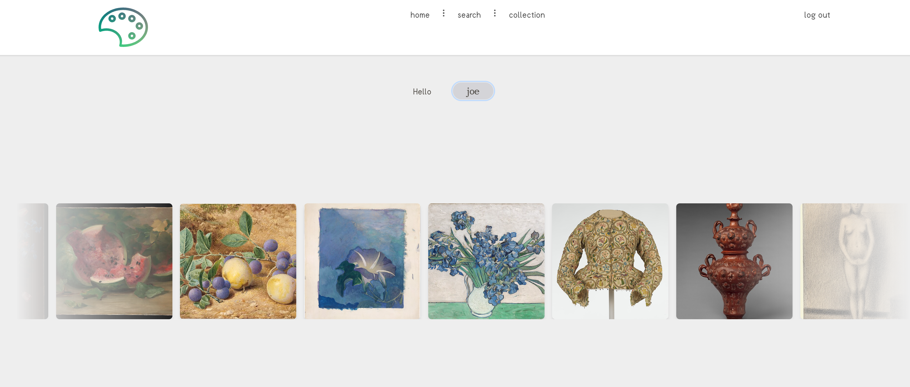

# Palette

Live hosted version viewable at [text](https://exhibition-project-two.vercel.app/)


## Features

- **Artwork Search**: Search artwork from the Met Museum and Art Institute of Chicago.
- **Dynamic Image Board**: Draggable and rearrangeable grid layout powered by Muuri.
- **User Collections**: Logged-in users can save artworks to their personal collections.
- **Authentication**: User login system with secure storage in Turso DB.
- **Svelte 5**: Built with Svelte 5 for a streamlined and reactive user experience.

## Technologies

- **Svelte 5 SvelteKit** - so bleeeding edge i probably used a bunch of deprecated features
- **Muuri** - JavaScript library for creating a flexible, draggable grid
- **Turso DB** - LibSQL db-aas, managed with Drizzle ORM
- **Drizzle ORM** - ORM for working with databases in TypeScript/JavaScript
- **JWT** - Persistence and state management with web tokens
- **Met Museum & ArtIC APIs** - For fetching artwork data

## Screenshots

 

## Getting Started

Follow these instructions to run Palette locally.

### Prerequisites

- **Node.js** - Make sure you have Node.js installed. You can download it from [nodejs.org](https://nodejs.org/).
- **Turso Account** - Create a free Turso account for database setup. Follow the [Turso Quickstart Guide](https://docs.turso.tech/quickstart).

### Setup

1. **Clone the repository:**

    ```bash
    git clone https://github.com/jmaccs/exhibition-project.git
    cd exhibition-project
    ```

2. **Install dependencies:**

    ```bash
    npm install
    ```

3. **Set up Turso Database:**

    - Create your Turso database by following [this guide](https://docs.turso.tech/quickstart).
    - Copy the generated **TURSO_DB_AUTH_TOKEN** and **TURSO_DB_URL** values.

4. **Configure Environment Variables:**

    Create a `.env` file in the root of your project with the following variables:

    ```plaintext
    TURSO_DB_AUTH_TOKEN="your-auth-token"
    TURSO_DB_URL="libsql://your-database-url"
    ```

5. **Run the Application:**

    ```bash
    npm run dev
    ```

6. **Access Palette:**

    Open [http://localhost:5173](http://localhost:5173) in your browser to start using Palette.

### Deployment

Palette can be deployed to any platform that supports Node.js. Make sure to set your environment variables for production:

- **TURSO_DB_AUTH_TOKEN** and **TURSO_DB_URL** for the database connection.

You can deploy to platforms like Vercel, Netlify, or any server supporting Node.js and static files.

## Contributing

1. Fork the repository.
2. Create a new branch (`git checkout -b feature/YourFeature`).
3. Make your changes.
4. Commit and push your changes (`git commit -m 'Add YourFeature'`).
5. Open a pull request.

## License

This project is licensed under the MIT License.

---


